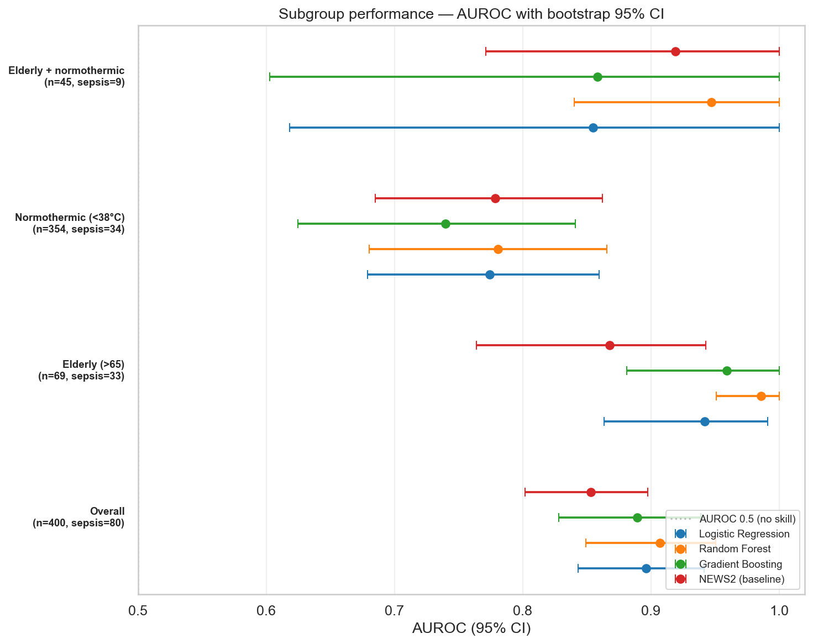
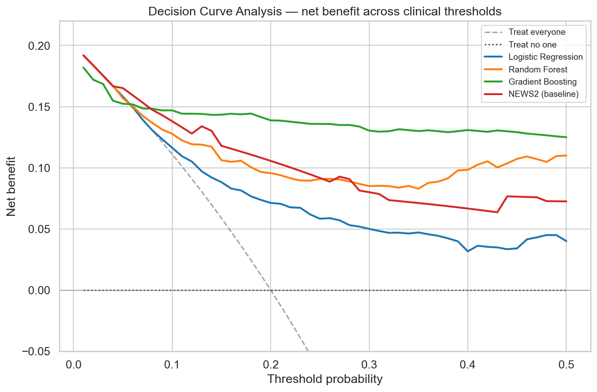
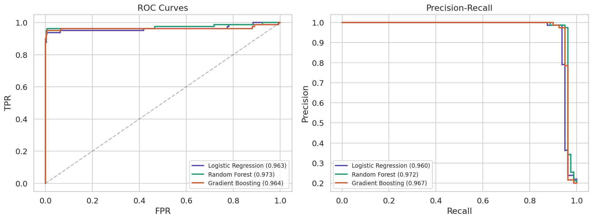
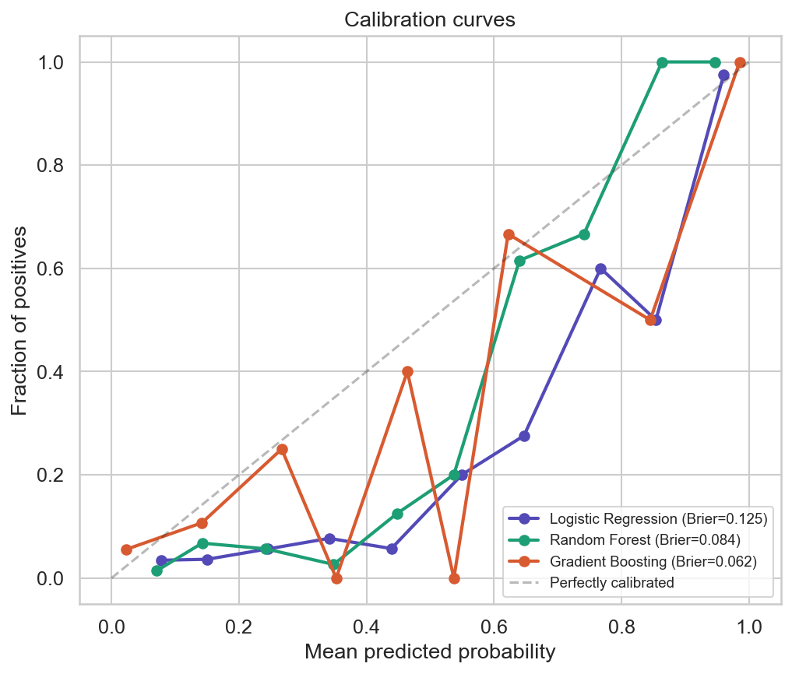
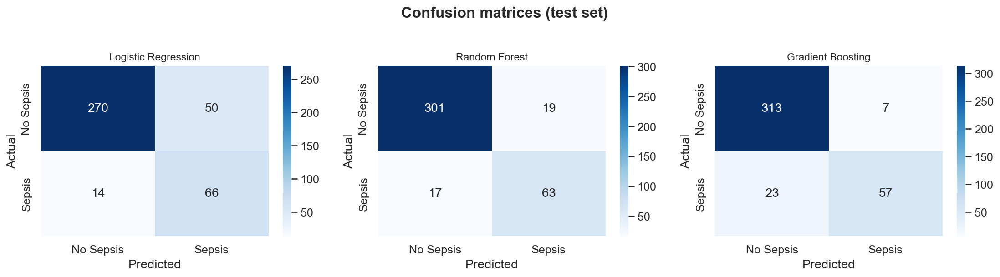
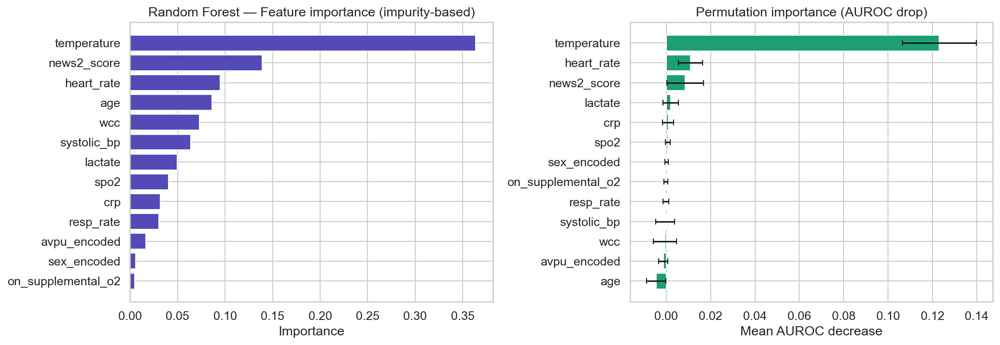

# Sepsis Early Detection — NEWS2 vs Machine Learning

<div align="center">

[](https://github.com/M-Omarjee/sepsis-ai/actions/workflows/ci.yml)
[](https://www.python.org/downloads/release/python-3110/)
[](LICENSE)

</div>

A reproducible benchmark comparing the NHS-standard **NEWS2 early warning score** against machine learning models for sepsis detection, with proper clinical evaluation (bootstrap CIs, decision curve analysis, and subgroup audits).

Built by a foundation doctor asking: *"Does ML actually beat the score we already use — and if so, where?"*

> ⚠️ **Disclaimer:** This project uses synthetic data for educational and portfolio purposes. It is **not** a validated clinical decision-support tool.

---

## The Question

The UK [National Early Warning Score (NEWS2)](https://www.rcplondon.ac.uk/projects/outputs/national-early-warning-score-news-2) is the NHS standard for detecting acute deterioration. It works — but it was not designed specifically for sepsis, and clinicians know it misses atypical presentations (e.g. the ~35% of septic patients who are normothermic).

This project asks three separable questions:

1. **Does ML meaningfully beat NEWS2 on equal-footing evaluation?**
2. **Do routine labs (WCC, lactate, CRP) add value, or is NEWS2 already near the ceiling of what vital signs can tell us?**
3. **Is ML's advantage uniform — or concentrated in specific patient subgroups where NEWS2 is known to be unreliable?**

---

## Headline Findings

On 2,000 synthetic patients (20% sepsis prevalence, 400-patient held-out test set, 1,000-iteration bootstrap CIs):

### 1. ML beats NEWS2 — but modestly, and mostly on AUPRC

| Model | AUROC (95% CI) | AUPRC (95% CI) | Brier |
|---|---|---|---|
| **Random Forest** | **0.907 (0.849–0.950)** | **0.864 (0.791–0.917)** | 0.084 |
| Logistic Regression | 0.896 (0.843–0.941) | 0.810 (0.729–0.878) | 0.125 |
| Gradient Boosting | 0.889 (0.828–0.939) | 0.847 (0.772–0.904) | **0.062** |
| NEWS2 (baseline, calibrated) | 0.853 (0.802–0.898) | 0.674 (0.576–0.762) | 0.103 |

NEWS2's AUROC CI **overlaps** with all ML models — on this sample size, ML is not unambiguously better at ranking patients. But NEWS2's AUPRC CI **does not overlap** with Random Forest's, meaning ML captures significantly more true positives per false alarm.

Gradient Boosting has the best calibration (lowest Brier), not the best AUROC — a reminder that "best model" depends on the question.

### 2. Non-linear modelling drives the gain — not the labs

| Approach | AUROC | Gain |
|---|---|---|
| NEWS2 alone (calibrated) | 0.853 | — |
| Simple LR on NEWS2 + 3 labs | 0.855 (0.798–0.899) | **+0.002** |
| Full ML (Random Forest) | 0.907 | **+0.051** |

Adding labs linearly adds essentially nothing. The full ML gain comes from capturing non-linear interactions in the vitals — not from the labs themselves.

### 3. The ML advantage doubles in elderly patients

<p align="center">
  
</p>

| Subgroup | RF AUROC | NEWS2 AUROC | Gap |
|---|---|---|---|
| Overall (n=400, sepsis=80) | 0.907 | 0.853 | +0.054 |
| **Elderly >65 (n=69, sepsis=33)** | **0.986** | **0.868** | **+0.118** |
| Normothermic <38°C (n=354, sepsis=34) | 0.781 | 0.779 | +0.002 |

**In elderly patients, RF and NEWS2 confidence intervals do not overlap** — the first statistically robust evidence of ML advantage in this dataset. Clinically, this matches the known limitation that elderly patients have blunted physiological responses that NEWS2 is poorly calibrated to.

In contrast, **when temperature is uninformative (normothermic sepsis), no model has enough signal to compensate** — ML doesn't have a secret sauce for this subgroup.

### 4. Decision Curve Analysis tells a different story than AUROC

<p align="center">
  
</p>

At low thresholds (<0.15 probability — where NHS NEWS2 ≥ 5 escalation sits), all models converge. **Logistic Regression is actually worse than NEWS2** at mid-thresholds (0.20–0.30) despite its higher AUROC — demonstrating that AUROC and clinical utility can diverge.

**Gradient Boosting dominates at high thresholds (>0.35)** where specificity matters — e.g. when deciding to commit a patient to broad-spectrum antibiotics.

---

## Evaluation Plots

<p align="center">
  
</p>

<p align="center">
  
</p>

<p align="center">
  
</p>

<p align="center">
  
</p>

---

## Dataset

2,000 synthetic patients (20% sepsis prevalence) with physiologically plausible distributions:

- **Vital signs:** respiratory rate, SpO₂, heart rate, systolic BP, temperature, AVPU
- **Laboratory markers:** WCC, lactate, CRP
- **Derived:** NEWS2 aggregate score, supplemental oxygen status
- **Demographics:** age, sex

Distributions are derived from [NEWS2 reference ranges (RCP, 2017)](https://www.rcplondon.ac.uk/projects/outputs/national-early-warning-score-news-2) and [Sepsis-3 criteria (Singer et al., JAMA 2016)](https://jamanetwork.com/journals/jama/fullarticle/2492881). A latent severity factor drives inter-feature correlations, with ~35% of sepsis patients simulated as normothermic. All vital signs and labs are generated from severity — not from the sepsis label directly — to avoid leakage.

> **On the AUROC value vs real-world literature:** Published MIMIC-IV sepsis models typically achieve AUROC 0.78–0.88; this project reports 0.91 on synthetic data. Synthetic distributions are cleaner than real patients, who have comorbidities, medication effects, and measurement variability. These numbers demonstrate pipeline correctness, not a performance claim that transfers to real data.

To regenerate:

```bash
python src/generate_data.py --seed 42
```

---

## Project Structure

sepsis-ai/
├── notebooks/
│   └── sepsis_detection.ipynb   # Full analysis: EDA → modelling → subgroup audit
├── src/
│   ├── generate_data.py         # Synthetic data generator
│   └── news2_baseline.py        # NEWS2 wrapper with isotonic calibration
├── data/raw/                    # Generated CSV
├── assets/                      # Saved plots
├── models/                      # Serialised best model (.joblib)
├── requirements.txt             # Pinned dependencies
└── README.md

---

## Quickstart

```bash
git clone https://github.com/M-Omarjee/sepsis-ai.git
cd sepsis-ai

# Python 3.11 virtual environment recommended
python3.11 -m venv .venv
source .venv/bin/activate

pip install -r requirements.txt

# Regenerate dataset (optional; one is shipped in data/raw/)
python src/generate_data.py

# Run the notebook
jupyter notebook notebooks/sepsis_detection.ipynb
```

---

## Methodology

1. **Data & preprocessing** — Label encoding of AVPU and sex; StandardScaler fitted on training set only; stratified 80/20 train-test split.
2. **Model training** — Logistic Regression, Random Forest, Gradient Boosting (each with 5-fold stratified CV on train), plus a calibrated **NEWS2 baseline** (isotonic regression mapping the ordinal score to probabilities — Niculescu-Mizil & Caruana, 2005).
3. **Discriminative evaluation** — AUROC, AUPRC, Brier score with 1,000-iteration bootstrap 95% CIs.
4. **Clinical evaluation** — Calibration curves and **Decision Curve Analysis** ([Vickers & Elkin, 2006](https://pubmed.ncbi.nlm.nih.gov/17099194/)) — net benefit vs treat-all/treat-none references across plausible thresholds.
5. **Subgroup audit** — Per-model AUROC with bootstrap CIs in clinically defined subgroups (elderly >65, normothermic <38°C, and their intersection).
6. **Feature importance** — Native importance and permutation importance (AUROC-based) for the best ML model.
7. **Ablation** — Three-layer decomposition (NEWS2 alone → simple LR on NEWS2+labs → full ML) to isolate whether gains come from labs or from non-linearity.

---

## Limitations

- **Synthetic data** — Modelled on published ranges, but cannot reproduce real-world complexity (comorbidities, medication effects, temporal trajectories, measurement noise).
- **Single time-point** — Each patient is one snapshot; real sepsis deterioration is a trajectory.
- **No external validation** — Metrics reflect performance on this synthetic cohort only.
- **Overlapping CIs overall** — Random Forest has the highest point estimate but is not statistically superior to LR or GB overall. The elderly-subgroup gap **is** statistically robust.
- **Sparse hardest subgroup** — Elderly + normothermic contains only 9 septic cases; CIs too wide for inference.
- **Correlated features limit permutation importance** — Vital signs that move together (HR, RR, NEWS2) have artificially reduced individual permutation importance.

---

## Next Steps

1. **External validation on real data** (MIMIC-IV / eICU) — the single most important next step.
2. **Temporal modelling** — Sequential vitals with LSTM or Temporal Fusion Transformer to capture deterioration trajectories, not snapshots.
3. **Gradio demo** — Clinician-facing calculator that displays NEWS2, ML prediction, and a per-feature contribution breakdown (SHAP) side by side.
4. **Fairness audit across sex and ethnicity** — Current audit covers age and temperature; sex- and ethnicity-stratified performance is a known concern in clinical ML.
5. **Deployment prototype** — FastAPI endpoint returning calibrated sepsis risk at clinically meaningful thresholds.

---

## Technical Stack

**Language:** Python 3.11
**Core libraries:** scikit-learn, pandas, NumPy, matplotlib, seaborn
**Baseline module:** custom `NEWS2Baseline` with isotonic calibration (`src/news2_baseline.py`)

---

## Author

**Dr Muhammed Omarjee**
Foundation Doctor (MBBS, King's College London 2023)
Exploring the intersection of clinical medicine and applied machine learning for NHS frontline workflows.

---

## License

[MIT](LICENSE)
